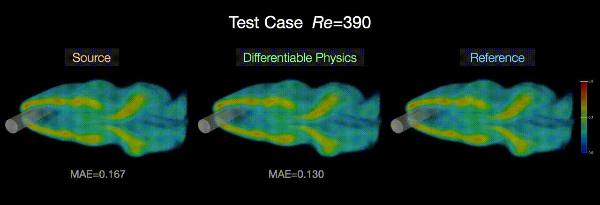

# Solver-in-the-Loop

This is the source code repository for the NeurIPS'20 paper
["Solver-in-the-Loop: Learning from Differentiable Physics to Interact with Iterative PDE-Solvers"](http://arxiv.org/abs/2007.00016) by Kiwon Um, Raymond (Yun) Fei, Philipp Holl, Robert Brand, and Nils Thuerey.

Additional information: [project page](https://ge.in.tum.de/publications/2020-um-solver-in-the-loop/), [NeurIPS 2020 page](https://proceedings.neurips.cc/paper/2020/hash/43e4e6a6f341e00671e123714de019a8-Abstract.html).



## Abstract:

Finding accurate solutions to partial differential equations (PDEs) is a crucial task in all scientific and engineering disciplines. It has recently been shown that machine learning methods can improve the solution accuracy by correcting for effects not captured by the discretized PDE. We target the problem of reducing numerical errors of iterative PDE solvers and compare different learning approaches for finding complex correction functions. We find that previously used learning approaches are significantly outperformed by methods that integrate the solver into the training loop and thereby allow the model to interact with the PDE during training. This provides the model with realistic input distributions that take previous corrections into account, yielding improvements in accuracy with stable rollouts of several hundred recurrent evaluation steps and surpassing even tailored supervised variants. We highlight the performance of the differentiable physics networks for a wide variety of PDEs, from non-linear advection-diffusion systems to three-dimensional Navier-Stokes flows.

[TUM](https://ge.in.tum.de/), 
[Telecom Paris](https://perso.telecom-paristech.fr/kum/)

# Tutorial

**Requirements**

- [TensorFlow](https://www.tensorflow.org/); *tested with 1.15*
- [PhiFlow](https://github.com/tum-pbs/PhiFlow); *tested with commit-4f5e678*

We recommend installing via pip, e.g., with `pip install tensorflow-gpu==1.15 phiflow`.

**Running the Code**

A makefile is included in a folder of each scenario, and a set of targets is provided. 
Running the targets one after another will generate training and test data, train a model, and apply it 
to the test cases.

For now, the unsteady wake flow (karman-2d/) and forced advection-diffusion (burgers/) scenarios in two dimensions are included in this repository.
(The others will follow later on.)

**Unsteady Wake Flow in 2D**

For karman-2d, you can first generate data sets, for training and testing respectively, by running:
```
make karman-fdt-hires-set      # Generate traning data set
make karman-fdt-hires-testset  # Generate test data set
```

This will create 1000 time steps of training data for six reynolds numbers, and test data sets for 
five different reynolds numbers. All are computed in *reference* space, with a higher resolution.
An example is shown below.


The following command uses the training data to train a SOL-32 model, i.e., one that's 
trained with 32 steps of differentiable physics in each ADAM iteration. 
```
make karman-fdt-sol32          # Train a model
```

Here the "magic" happens following line 397 of *karman_train.py* in the loop over `msteps`, which controls the number of time steps computed in each iteration. The call to `simulator_lo.step()` constructs a tensorflow graph for the modified incompressible fluid solver from phiflow. Each `sess.run()` call in line 500 executes the full graph for a mini-batch, and back-propagates the error via the differentiable phiflow operators.

Once the model is trained, you can apply it to the test data via:
```
make karman-fdt-sol32/run_test # Run test
```
This generates sequences of .npz files for velocity and a transported marker density in *karman-fdt-sol32/run_test/sim_00000n*, which you can visualize with your favourite numpy tools. Below you can find an example output, showing unmodified source at the top, the corrected SOL-32 version in the middle, and the reference at the bottom.


The NON model discussed in our paper can be trained via the target *karman-fdt-non*. The makefile additionally contains *-pre* targets to compute the PRE training data mentioned in the paper, and train a corresponding model. 

**Forced Advection-Diffusion in 2D**

Similar to the unsteady wake flow scenario, you can use the Makefile targets.

# Closing Remarks

If you find the approach useful, please cite our paper via:
```
@article{um2020sol,
  title="{Solver-in-the-Loop: Learning from Differentiable Physics to Interact with Iterative PDE-Solvers}",
  author={Um, Kiwon and Fei, Yun and Brand, Robert and Holl, Philipp and Thuerey, Nils},
  journal={Advances in Neural Information Processing Systems},
  year={2020}
}
```

This work is supported by the ERC Starting Grant realFlow (StG-2015-637014).

Feel free to contact us if you have questions or suggestions.


